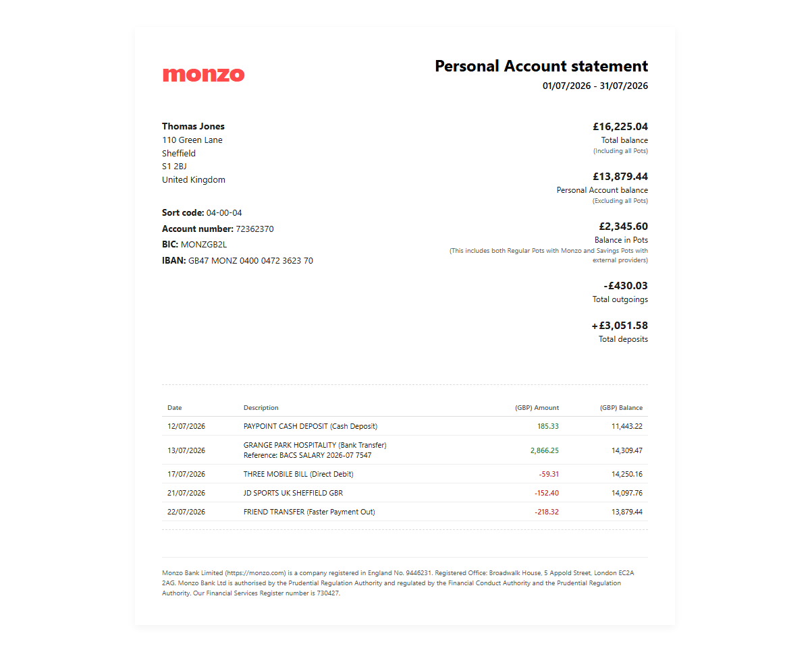
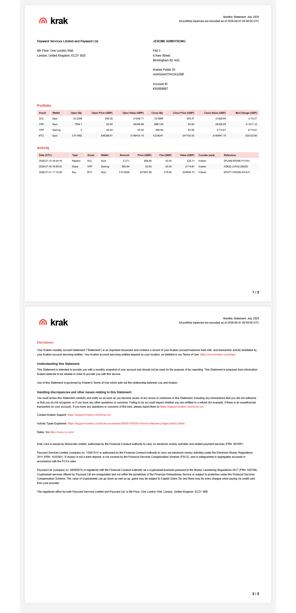
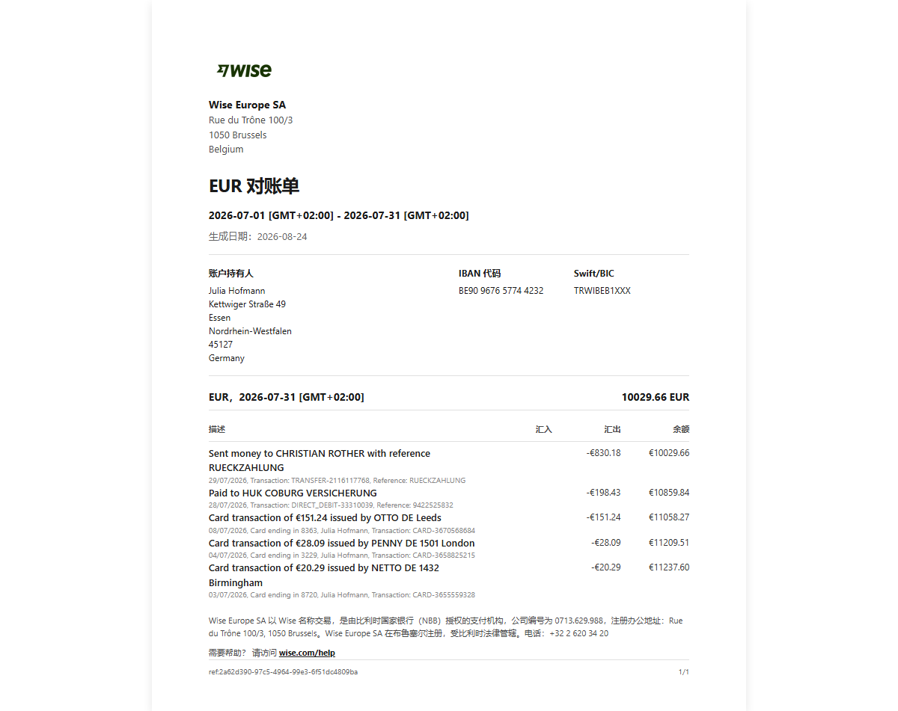
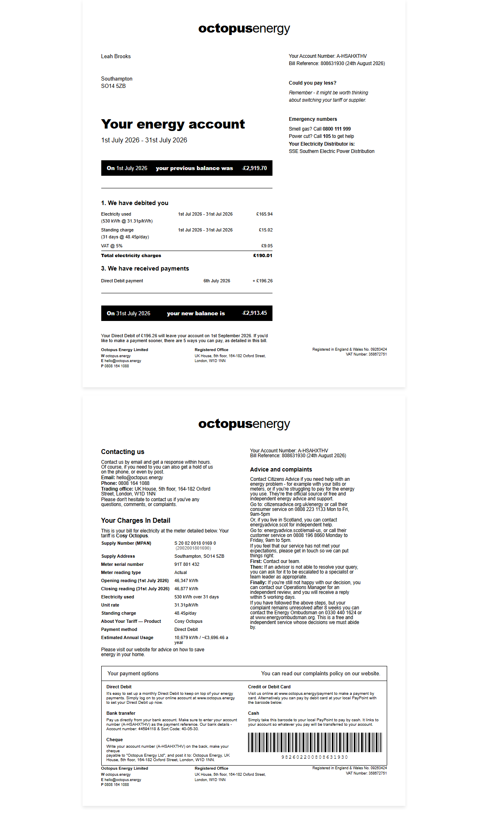
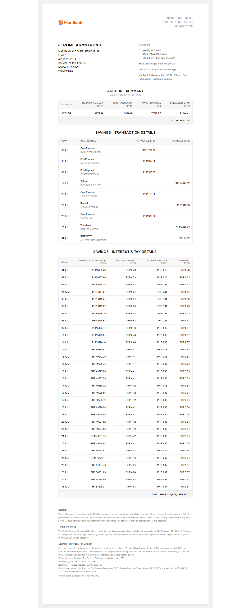

# oneT

> **本工具仅用于学习、演示与测试，禁止用于任何欺诈或误导第三方的用途。**
> 详细法律声明请参阅 [DISCLAIMER.md](./DISCLAIMER.md)。

---

## 项目简介

oneT 账单生成器是一个 Python 桌面工具，用于生成**模拟/样例**金融与账单类文档，包括银行对账单、加密货币账户月结单、能源账单等。生成的文档可供设计稿填充、前端开发测试、数据模型验证、自动化测试夹具、文档生成技术研究等非商业个人场景使用。

- **GitHub**: [UserNmaeF/oneT](https://github.com/UserNmaeF/oneT)
- **技术栈**: Python 3 + tkinter GUI + Playwright 渲染 + 本地 HTML 模板引擎
- **输出格式**: PDF、PNG、HTML

---

## 样例预览

| Monzo Bank Statement | Kraken Statement | Wise EUR Statement |
|:---:|:---:|:---:|
|  |  |  |

| Octopus Energy Bill | MariBank Statement |
|:---:|:---:|
|  |  |

---

## 主要功能

- **7 种账单类型**：涵盖英国、德国、菲律宾三地银行、加密货币与能源账单
- **GUI 交互**：基于 tkinter 的图形界面（线程安全预览、单实例锁），一键填充、实时预览 PDF/PNG 输出；`start_oneT.vbs` 提供无控制台黑窗的启动入口
- **CLI 命令行**：支持批量生成、数据完整性验证，适合 CI/CD 与自动化测试
- **地址簿三元绑定**：英国/德国/菲律宾均以内置地址簿整条记录为准（城市-街道-邮编现实组合强绑定，德国街道簿含门牌上限）；randomuser.me 仅作候选来源，返回结果须通过地址簿校验过滤后才会被采用
- **加密货币实时价格**：从 CoinGecko API 获取历史价格，API 不可用时回退到合理范围
- **余额自动闭合**：银行账单、Wise 账户、Octopus 能源账单均自动计算并确保余额公式闭合
- **DNO 配电区映射**：Octopus 账单根据城市/邮编自动匹配英国配电运营商，MPAN 按素数权重 MOD11 生成合法校验位，LLD 取值收敛至 ENA 锚定五组
- **会话级价格缓存**：同一进程内多份账单使用同一组市场价格，确保一致性
- **线程安全渲染**：Playwright 渲染器使用固定线程池，支持并发生成

---

## 快速开始

### 环境要求

- Python 3.10+
- 安装依赖

```bash
pip install -r requirements.txt
```

安装 Playwright 浏览器（首次使用）：

```bash
playwright install chromium
```

### GUI 启动

```bash
python main.py
```

Windows 下无控制台黑窗启动，双击项目根目录的 `start_oneT.vbs`（或为其创建桌面快捷方式）：

- 启动器显式调用 `pythonw.exe`（无控制台解释器）运行 `main.pyw`，不受系统 `.pyw` 文件关联错误指向 `python.exe` 的影响
- 若未找到 `pythonw.exe`，按提示编辑脚本内的候选路径即可

> GUI 内置单实例锁：重复启动会弹窗提示。锁采用 Windows 命名互斥体实现，
> 程序崩溃/被强杀后不会残留误报；若互斥体与端口绑定均不可用（如端口被系统保留），
> 会放行启动并在控制台输出警告，不会误判为"已在运行"。

### 命令行使用

列出所有可用账单类型：

```bash
python cli.py list
```

生成单份账单（默认输出 PDF 到 `./output/`）：

```bash
python cli.py gen --type gb-monzo
```

指定输出格式与目录：

```bash
python cli.py gen --type gb-kraken --format png --out ./my_bills/
```

批量生成 10 份：

```bash
python cli.py gen --type gb-monzo --count 10
```

生成所有类型：

```bash
python cli.py gen --all
```

固定随机种子（可复现）：

```bash
python cli.py gen --type gb-monzo --seed 42
```

验证数据完整性：

```bash
python cli.py validate --type gb-monzo
```

> Windows 控制台默认 GBK 编码时，运行 CLI 出现 `UnicodeEncodeError` 属环境问题，
> 先执行 `$env:PYTHONUTF8 = '1'` 再运行即可。

---

## 支持账单类型一览

| 类型代码 | 名称 | 地区 | 币种 | 分类 |
|---|---|---|---|---|
| `gb-monzo` | Monzo Bank Statement | 英国 | GBP | 银行 |
| `gb-kraken` | Kraken Statement | 英国 | GBP | 加密货币 |
| `de-wise` | Wise EUR Statement (DE) | 德国 | EUR | 银行 |
| `gb-wisegbpstatementuk` | Wise GBP Statement (UK) | 英国 | GBP | 银行 |
| `gb-octopusenergybill` | Octopus Energy Bill | 英国 | GBP | 能源 |
| `ph-seabank` | MariBank Statement | 菲律宾 | PHP | 银行 |
| `de-monese` | Monese EUR Statement (DE) | 德国 | EUR | 银行 |

---

## 目录结构

```
oneT/
├── main.py                  # GUI 入口
├── main.pyw                 # 无控制台窗口的 GUI 启动入口
├── start_oneT.vbs           # Windows 无黑窗启动器（调用 pythonw.exe）
├── cli.py                   # CLI 入口（list / gen / validate）
├── requirements.txt         # Python 依赖
├── config/
│   └── settings.py          # 全局配置（账单类型、地区、自动字段等）
├── core/
│   ├── models.py            # 数据模型定义
│   ├── defaults.py          # 默认值生成（随机姓名、三地地址簿、IBAN 等）
│   ├── placeholders.py      # 占位符提取与中文描述映射
│   ├── html_builder.py      # HTML 账单文档生成（占位符替换）
│   ├── template_loader.py   # 模板加载器
│   ├── transaction_generator.py  # 交易记录生成器（含 Octopus 账单模型）
│   ├── crypto_prices.py     # CoinGecko 加密货币价格获取
│   ├── dno_map.py           # 英国 DNO 配电区映射与 MPAN 生成
│   └── services/
│       ├── bill_service.py  # 账单生成服务（核心编排）
│       └── address_service.py  # 地址获取服务（API 候选，地址簿校验兜底）
├── data/
│   ├── address_pool.py      # 本地随机地址数据池
│   └── templates/           # 账单模板目录
│       ├── gb-monzo/
│       ├── gb-kraken/
│       ├── de-wise/
│       ├── gb-wisegbpstatementuk/
│       ├── gb-octopusenergybill/
│       ├── ph-seabank/
│       └── de-monese/
├── renderers/
│   ├── base.py              # 渲染器抽象接口
│   └── playwright.py        # Playwright 渲染器实现（线程安全）
├── gui/
│   ├── app.py               # 主窗口应用
│   ├── controller.py        # 控制器（线程安全调度）
│   ├── form_panel.py        # 表单面板
│   └── preview_panel.py     # 预览面板
└── assets/                  # 静态资源（Logo 图片等，以 data URI 嵌入模板）
```

---

## 许可证

本项目按"原样"提供，不提供任何明示或暗示担保。详见 [DISCLAIMER.md](./DISCLAIMER.md)。

---

## ⭐ 支持项目

如果你觉得这个项目对你有帮助，欢迎给个 **Star** ⭐！

你的支持是持续改进的动力，感谢每一位贡献者！

[](https://github.com/UserNmaeF/oneT)
[](https://github.com/UserNmaeF/oneT)

---

## 免责声明

**重要：** 本工具生成的文档均为模拟数据，严禁用于冒充真实账单、欺诈、骗贷或任何违法用途。详细免责条款请参阅 [DISCLAIMER.md](./DISCLAIMER.md)。